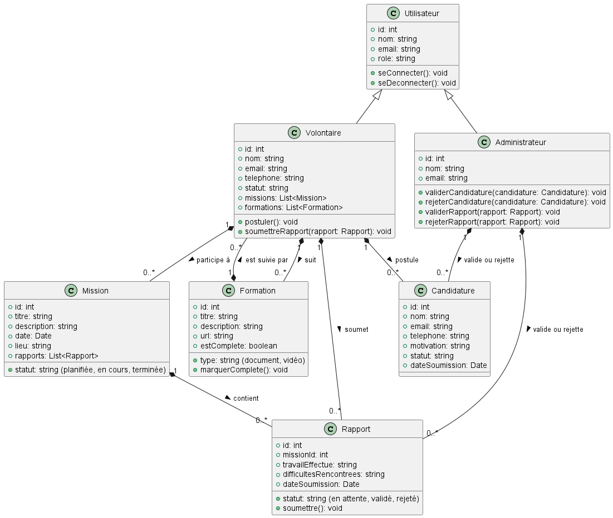

= CleanUp Heroes
By Adjedomole, Barry, Rahim

== Description de l'application
Ce site a pour ambition de sensibiliser les citoyens au tri sélectif et au respect de l’environnement tout en les encourageant à agir activement pour améliorer leur cadre de vie. Les utilisateurs peuvent participer à des **challenges environnementaux** qui leur permettent de gagner des points en réalisant des actions concrètes, telles que le tri des déchets ou la participation à des initiatives locales. Ces points accumulés pourront, à l’avenir, être échangés contre des récompenses concrètes, renforçant ainsi leur motivation à s’impliquer durablement.

En parallèle, le site offre une fonctionnalité clé : le **signalement de déchets abandonnés** dans les espaces publics. Ces signalements sont actuellement affichés sous forme de liste, mais une évolution future prévoit l’intégration d’une carte interactive. Chaque signalement sera représenté par un marqueur géolocalisé, offrant une vue claire des zones concernées. Une fois un déchet ramassé, son marqueur pourra être retiré de la carte pour refléter la propreté retrouvée de l’espace. Cette fonctionnalité vise à améliorer la coordination entre citoyens et services responsables, tout en fournissant un outil visuel pour mesurer les progrès réalisés.

Le site mettra également en avant des **classements mondiaux et locaux**, permettant aux utilisateurs de comparer leurs contributions avec celles des autres. Ces classements encourageront une saine compétition et renforceront le sentiment de communauté autour de la cause environnementale.

== Objectif de l'application
L’objectif global de ce projet est de promouvoir des comportements responsables, tels que le tri sélectif et la collecte des déchets, tout en récompensant l’engagement des utilisateurs. En combinant des éléments ludiques comme les challenges et les classements, des outils pratiques comme la carte interactive, et des perspectives d’avenir avec des récompenses concrètes, ce site ambitionne de devenir une plateforme incontournable pour tous ceux qui souhaitent agir pour l’environnement.

== Tableau comparatif des solutions existantes

[cols="1,2,2", options="header"]
|===
| **Solution**   | **Avantages** | **Limites**
| **Litterati**   | - Encourage un nettoyage collaboratif.+
- Implique activement les utilisateurs dans la géolocalisation des déchets. | - Dépend de l’implication des utilisateurs.+
- Difficulté à s’étendre dans les zones rurales.
| **Recyclebank** | - Récompenses attractives (réductions locales). +
- Incite au recyclage continu. | - Limité aux zones partenaires. +
- Offre de récompenses restreinte.
| **TrashOut**    | - Permet de signaler et cartographier les déchets. +
- Facilite une gestion collective. | - Dépend des signalements des utilisateurs (informations parfois inexactes). +
- Système décentralisé.
| **Tidy Towns**  | - Encourage la participation communautaire par des récompenses. +
- Focalisé sur l’embellissement des villes. | - Nécessite une bonne organisation d’événements. +
- Implique fortement les communautés locales.
| **EcoHero**     | - Dimension ludique avec des défis et récompenses. +
- Encourage des comportements durables. | - Manque d’adaptation aux spécificités locales. +
- Nécessite un engagement constant des utilisateurs.
|===

== Avantages supplémentaires de **CleanUp Heroes**

**CleanUp Heroes** apporte des innovations et fonctionnalités supplémentaires par rapport aux solutions existantes :

. **Fonctionnalités intégrées et complémentaires** :
   * **Signalements cartographiés** : Les utilisateurs peuvent signaler des déchets géolocalisés via une carte interactive, qui évolue en temps réel. Les signalements peuvent être retirés une fois les déchets ramassés.
   * **Classements dynamiques** : Un classement mondial et local permet de motiver les utilisateurs en favorisant une saine compétition.
   * **Récompenses concrètes** : Les utilisateurs peuvent gagner des avantages auprès de commerçants locaux en atteignant des objectifs spécifiques, renforçant leur motivation.

. **Impact visible et mesurable** :
   L'application propose une estimation chiffrée de l’impact positif des actions des utilisateurs (par exemple, quantité de déchets collectés, CO2 économisé), renforçant leur sentiment d'accomplissement et d’utilité.

. **Engagement communautaire renforcé** :
   En liant les défis individuels et communautaires, l'application crée une synergie entre citoyens, entreprises locales et collectivités, encourageant une participation active à grande échelle.

. **Conception ludique et motivante** :
   Grâce à l'intégration d'éléments ludiques comme les défis et les récompenses, CleanUp Heroes s’assure de maintenir un haut niveau d’engagement des utilisateurs.

== Architecture de l'application

image::images/architecture_projet.png[architecture de l'application, width=200, align=center]

== Features

=== Feature 1

==== Participation à un défi
.**Objectif** :
Cette fonctionnalité permet à l’utilisateur de participer activement à un défi. Lors de la soumission, l'utilisateur peut :

* Renseigner la quantité réalisée pour le défi (par exemple, kilos de déchets triés).
* Indiquer la date de réalisation.
* Joindre une photo comme preuve de sa contribution.

.**But principal** :
Faciliter la collecte de données sur les actions réalisées par les utilisateurs tout en garantissant la vérifiabilité des participations. Cela permet de valoriser les efforts de chacun et de maintenir une transparence dans le processus.

==== Affichage des défis disponibles
.**Objectif** :
Cette fonctionnalité permet aux utilisateurs de visualiser tous les défis de tri et de réduction des déchets disponibles auxquels ils n'ont pas encore participé. Chaque défi est accompagné de détails importants tels que son nom, sa description, ses dates de validité, les actions attendues, et les points qu’il rapporte.

.**But principal** :
Encourager les utilisateurs à s’impliquer dans les initiatives écologiques proposées par la plateforme en leur fournissant une vue claire et détaillée des défis disponibles. La possibilité de participer en un clic renforce l'engagement.

==== Statistiques des défis
.**Objectif** :
Cette fonctionnalité offre à l'utilisateur un tableau de bord interactif permettant de suivre ses performances et ses progrès dans les défis. Elle inclut des statistiques telles que :

* Le nombre total de défis accomplis.
* La quantité totale réalisée dans les actions demandées.
* Le score total accumulé.
* La progression des défis en cours (en pourcentage).

.**But principal** :
Motiver les utilisateurs en leur offrant un retour visuel sur leurs réalisations et leur impact positif. Cela favorise également une compétition saine et un sentiment de satisfaction personnelle.

==== Diagramme de séquence

===== Les défis

===== Statistiques

Voici une version améliorée et plus structurée pour cette section :  

=== Feature 2  

==== Système de gestion des signalements  

===== Affichage des signalements existants  
**Objectif** : Offrir une visibilité claire sur les déchets signalés grâce à une carte interactive intuitive.  
- Les signalements déjà enregistrés sont représentés par des **marqueurs géolocalisés** sur la carte.  
- **Interaction avec les marqueurs** :  
  - Cliquer sur un marqueur ouvre une **popup** affichant des informations détaillées, telles que :  
    - Description du signalement.  
    - Photo du déchet (si disponible).  
    - Date et heure du signalement.  
- **Mise à jour dynamique** : Une fois le déchet ramassé, le marqueur correspondant disparaît de la carte, garantissant une interface toujours à jour.  

===== Création d’un signalement via la carte  
**Objectif** : Faciliter et moderniser le signalement des déchets grâce à une expérience interactive simple et rapide.  

1. **Sélection de l’emplacement** :  
   - L’utilisateur clique sur l’emplacement exact du déchet sur la carte interactive.  
   - Une **popup contextuelle** s’affiche, indiquant les coordonnées GPS et proposant un bouton "Signaler".  

2. **Accès au formulaire de signalement** :  
   - En cliquant sur "Signaler", l’utilisateur est redirigé vers un formulaire prérempli avec :  
     - Les **coordonnées géographiques** du point sélectionné.  
     - Un champ pour ajouter une **description** détaillée du déchet.  
     - Un champ pour joindre une **photo** du déchet (optionnel mais recommandé).  
     - Un champ indiquant l’**adresse approximative**, dérivée automatiquement des coordonnées.  

3. **Finalisation** :  
   - Après avoir rempli les informations, l’utilisateur soumet le formulaire pour enregistrer le signalement.  

**Atout principal** : Ce processus assure une **précision géographique** accrue tout en rendant la création de signalements rapide et intuitive.  

===== Scénarios d’utilisation  
1. **Utilisateur standard** :  
   - Peut créer un signalement.  
   - Consulte les signalements existants.  

===== Processus des signalements

=== Feature 3  

==== Classement des utilisateurs  

===== Objectif général  
Foster une compétition saine et encourager la participation active en mettant en place un système de classement basé sur les actions des utilisateurs.  

===== Fonctionnement du système de classement  

1. **Critères de classement** :  
   - Le classement des utilisateurs est basé sur des **points** attribués en fonction de leurs contributions.  
   
2. **Type de classement disponible** :  
   - **Global** : Affiche les meilleurs utilisateurs de la plateforme.  
   

3. **Affichage du classement** :  
   - Classement présenté sous forme de tableau avec :  
     - Nom ou pseudonyme de l’utilisateur.  
     - Nombre total de points accumulés.  

===== Classement des utilisateurs

=== Feature 4

=== **Gestion d'un Programme de Volontariat (Grande Fonctionnalité)**

==== **Description**  
Un système complet conçu pour recruter, former et organiser des volontaires pour des actions de nettoyage. Ce programme assure un processus structuré de gestion des volontaires, depuis leur recrutement jusqu'au suivi de leurs missions.

---

=== **Implémentation**

==== **1. Recrutement de Volontaires**  
* **Objectif** : Permettre aux utilisateurs intéressés de soumettre leur candidature pour devenir volontaires.  
* **Fonctionnement** :  
    * Les utilisateurs remplissent un formulaire comprenant leur nom, leurs coordonnées et leurs motivations.  
    * Les données soumises sont envoyées au backend via une requête **POST** et enregistrées dans une base spécifique pour être examinées.  
* **Exemple d’interaction** :  
    * Un utilisateur soumet une candidature via un formulaire. Une fois la candidature enregistrée, un message de confirmation s’affiche.  

==== **2. Validation et Affectation**  
* **Objectif** : Permettre aux administrateurs de gérer et d'affecter les volontaires validés.  
* **Fonctionnement** :  
    * **GET** : Les administrateurs accèdent à la liste des candidatures en attente.  
    * **PUT** : Ils peuvent valider ou refuser une candidature en ajoutant un commentaire justifiant leur décision.  
    * Les volontaires validés sont assignés à des zones ou des événements spécifiques en fonction des besoins.  
* **Exemple d’interaction** :  
    * Un administrateur valide une candidature et affecte le volontaire à une zone de nettoyage.  

==== **3. Formation des Volontaires**  
* **Objectif** : Préparer les volontaires grâce à une bibliothèque de ressources pédagogiques.  
* **Fonctionnement** :  
    * Une fois validés, les volontaires accèdent via **GET** à une bibliothèque contenant des documents, vidéos et autres supports de formation.  
    * Les volontaires confirment qu’ils ont suivi les formations via une requête **POST**, ce qui met à jour leur statut dans la base de données.  
* **Exemple d’interaction** :  
    * Un volontaire termine une formation vidéo et valide son statut de formation via l'interface utilisateur.  

==== **4. Suivi des Missions**  
* **Objectif** : Assurer un suivi des missions réalisées par les volontaires et fournir un retour aux administrateurs.  
* **Fonctionnement** :  
    * **POST** : Les volontaires remplissent un rapport après chaque mission, détaillant :  
        * Le travail effectué.  
        * Les difficultés rencontrées.  
    * **GET/PUT** : Les administrateurs consultent ces rapports et peuvent les valider ou ajouter des commentaires pour amélioration.  
* **Exemple d’interaction** :  
    * Un volontaire soumet un rapport mentionnant les difficultés rencontrées. L’administrateur valide le rapport et informe l’équipe d’améliorations possibles.  

---

=== **Scénarios d’Utilisation**

* **Volontaire** :  
    * Soumet sa candidature, suit les formations, et remplit des rapports de mission.  
* **Administrateur** :  
    * Valide ou refuse les candidatures, affecte les volontaires, gère les formations et valide les rapports de mission.  
* **Superviseur de mission** :  
    * Suit la progression des volontaires, analyse les rapports pour ajuster les futures missions et optimise les affectations.

Ce système centralisé permet une gestion efficace et structurée des volontaires, favorisant une organisation fluide et un suivi rigoureux des activités de nettoyage.

==== Diagramme de Séquence

==== Diagramme de  Classe

=== FEATURE 5 : Création et Participation à des Événements de Nettoyage (Grande fonctionnalité)

<<<<<<< HEAD
==== Description
Cette fonctionnalité permet aux utilisateurs de contribuer activement à la propreté de leur environnement en créant et en participant à des événements de nettoyage communautaires. Elle offre également un outil pratique pour consulter leur historique de participation.

==== Sous-fonctionnalités

1. **Création d'événements**
    - **Objectif** : Les utilisateurs peuvent créer un événement de nettoyage en renseignant des informations essentielles, telles que :
        * Le titre de l’événement.
        * La localisation.
        * La date et l’heure.
        * Une description.
        * Le nombre maximum de participants.
    - **But principal** : Encourager l’organisation d’initiatives locales en facilitant leur planification et leur partage via la plateforme.

2. **Participation à des événements**
    - **Objectif** : Les utilisateurs peuvent s’inscrire à des événements créés par d'autres utilisateurs en remplissant un formulaire avec des informations comme :
        * Leur nom ou pseudo.
        * Un commentaire éventuel (facultatif).
    - **But principal** : Favoriser l'engagement communautaire en rendant les événements accessibles et inclusifs.

3. **Historique des événements**
    - **Objectif** : Les utilisateurs peuvent consulter leur historique d’événements, comprenant :
        * Les événements auxquels ils ont participé.
        * Les événements qu'ils ont créés.
        * Les événements passés et à venir.
    - **But principal** : Fournir une vue d'ensemble de l'engagement de l'utilisateur tout en renforçant leur motivation à participer à des initiatives futures.

    ==== Exemple d'Interaction
- L'utilisateur clique sur "Créer un événement".
- Il remplit les informations nécessaires dans le formulaire et soumet sa demande.
- Un message de confirmation s'affiche une fois que l'événement est enregistré.
- Un autre utilisateur consulte la liste des événements disponibles, choisit un événement et remplit le formulaire d'inscription.
- Enfin, l'utilisateur peut consulter son historique pour voir les événements auxquels il a participé ou qu’il a créés.

===== Diagramme de Séquence

### **Feature 6 : Gestion du Forum**  

#### **Description**  
Un espace de discussion où les utilisateurs peuvent lire, créer et répondre à des sujets. Le forum permet également de signaler des contenus inappropriés et offre aux modérateurs des outils pour gérer ces signalements.  

---

### **Implémentation**  

#### **1. Lecture et Navigation dans le Forum**  
* **Objectif** : Permettre aux utilisateurs d'explorer les discussions existantes.  
* **Fonctionnement** :  
    * **GET** : Affichage de la liste des sujets avec pagination et filtres (par catégorie, popularité, récence).  
    * **GET** : Consultation d’un sujet avec ses réponses associées.  
* **Exemple d’interaction** :  
    * Un utilisateur accède à la page du forum et sélectionne un sujet pour voir son contenu et les réponses existantes.  

#### **2. Création de Sujets et Réponses**  
* **Objectif** : Permettre aux utilisateurs de participer activement aux discussions.  
* **Fonctionnement** :  
    * **POST** : Création d’un nouveau sujet avec titre, contenu et sélection d’une catégorie.  
    * **POST** : Ajout d’une réponse à un sujet existant.  
    * **GET** : Rafraîchissement automatique des nouvelles réponses.  
* **Exemple d’interaction** :  
    * Un utilisateur crée un sujet en remplissant le formulaire. Une fois soumis, le sujet est affiché dans la liste et accessible aux autres utilisateurs.  

#### **3. Signalement des Contenus**  
* **Objectif** : Offrir un mécanisme pour signaler les messages inappropriés.  
* **Fonctionnement** :  
    * **POST** : Un utilisateur signale un sujet ou une réponse en fournissant un motif.  
    * **GET** : Affichage de la liste des signalements pour les modérateurs.  
* **Exemple d’interaction** :  
    * Un utilisateur signale une réponse abusive. Un modérateur pourra ensuite examiner ce signalement via son interface de gestion.  

#### **4. Modération des Signalements**  
* **Objectif** : Permettre aux modérateurs de traiter les signalements reçus.  
* **Fonctionnement** :  
    * **GET** : Liste des signalements en attente de traitement.  
    * **POST** : Action du modérateur (suppression du contenu ou rejet du signalement).  
    * **GET** : Mise à jour de l’état du signalement après action.  
* **Exemple d’interaction** :  
    * Un modérateur examine un signalement, décide de supprimer la réponse concernée et enregistre son action.  

---

### **Scénarios d’Utilisation**  

* **Utilisateur** :  
    * Consulte les discussions, crée des sujets et répond aux messages.  
    * Signale un contenu inapproprié si nécessaire.  

* **Modérateur** :  
    * Consulte la liste des signalements et prend une décision (suppression ou rejet du signalement).  

Ce système de forum encourage l’échange structuré tout en garantissant une modération efficace pour maintenir un espace de discussion respectueux.  

=== Feature 7 : Education aux ramassages des déchets et récompenses
Participation au Quiz environnement et Obtention des Récompenses (Grande Fonctionnalité)

Description
Un système interactif permettant aux utilisateurs de participer à des quiz environnementaux, de gagner des points, et d'échanger ces points contre des récompenses. Les récompenses incluent des badges, des rendez-vous pour des sachets poubelles biodégradables, et de l'argent fictif.

Implémentation
1. Participation au Quiz
Objectif : Permettre aux utilisateurs de répondre à des questions sur des thèmes environnementaux et de gagner des points.

Fonctionnement :

Les utilisateurs accèdent à une liste de questions via une requête GET.

Ils sélectionnent des réponses, qui sont envoyées au backend via une requête POST pour validation.

Le backend vérifie les réponses et retourne un score.

Exemple d’interaction :

Un utilisateur répond à 10 questions et obtient un score de 4/10.

2. Gestion des Points
Objectif : Suivre les points gagnés par les utilisateurs et les rendre échangeables contre des récompenses.

Fonctionnement :

Les points sont stockés dans la base de données et mis à jour après chaque quiz.

Les utilisateurs peuvent consulter leur solde de points via une requête GET.

Exemple d’interaction :

Un utilisateur consulte son solde de points (ex : 7 points).

3. Obtention des Récompenses
Objectif : Permettre aux utilisateurs d'échanger leurs points contre des récompenses.

Fonctionnement :

Les utilisateurs accèdent à une liste de récompenses disponibles via une requête GET.

Ils sélectionnent une récompense, et le backend vérifie si les points sont suffisants via une requête POST.

Si les points sont suffisants, la récompense est confirmée, et les points sont déduits.

Exemple d’interaction :

Un utilisateur échange 10 points contre un badge Éco-Responsable.

4. Réclamation des Récompenses
Objectif : Permettre aux utilisateurs de réclamer leurs récompenses via un e-mail.

Fonctionnement :

Les utilisateurs envoient un e-mail avec leur badge ou leurs points pour réclamer leur récompense.

Les administrateurs valident la réclamation et envoient la récompense.

Exemple d’interaction :

Un utilisateur envoie un e-mail pour réclamer un rendez-vous pour des sachets poubelles biodégradables.

Scénarios d’Utilisation
Utilisateur :

Participe à des quiz, consulte son solde de points, et échange des points contre des récompenses.

Administrateur :

Gère les questions du quiz, valide les réclamations de récompenses, et suit les points des utilisateurs.

Ce système encourage l'engagement des utilisateurs en récompensant leurs connaissances et leurs actions en faveur de l'environnement.

===== Diagramme de Séquence

image::images/seq.png[Diagramme de Séquence, width=500, align=center]

===== Diagramme de  Classe

== Wireframe
=== Acceuil

=== Feature 1

image::images/2.png[wire2, width=500, align=center]

// === Feature 2

// image::images/3.png[wire3, width=500, align=center]

=== Feature 2

=== Feature 3

=== Feature 4
image::images/liv1.png[wire3, width=500, align=center]

=== Feature 5

image::images/W3.png[wire3, width=500, align=center]

=== Feature 6 : 

=== Feature 7 :

=== à propos

image::images/4.png[wire4, width=500, align=center]
