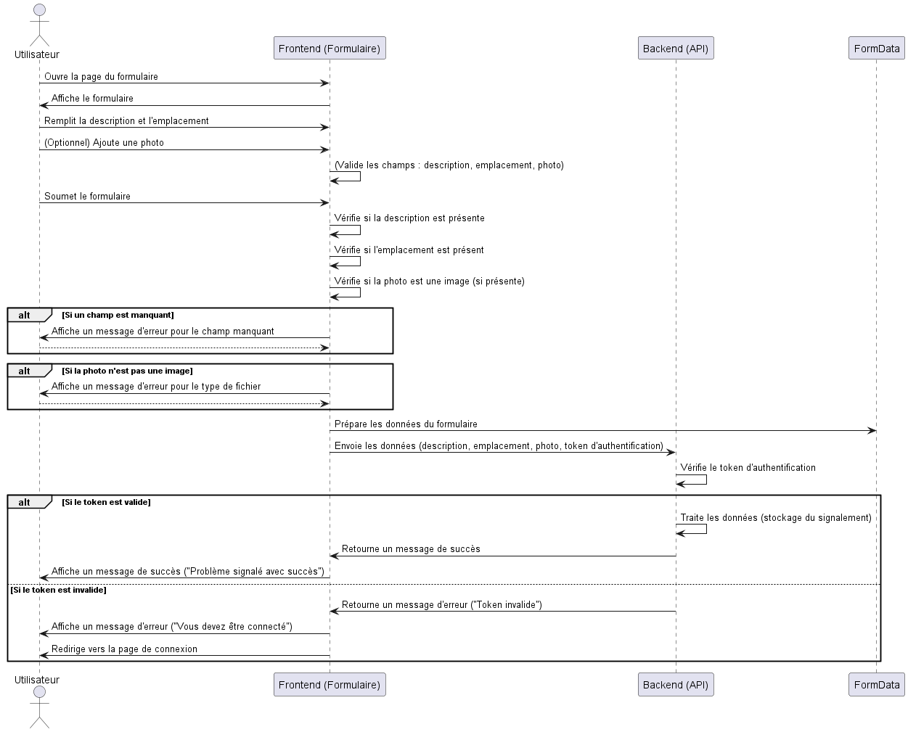
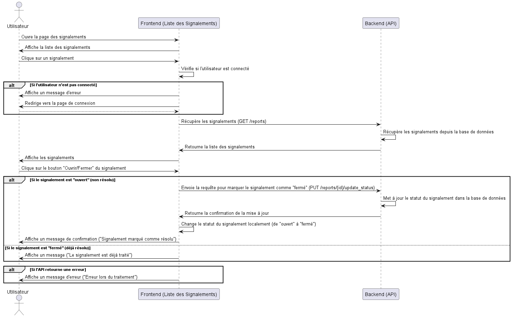
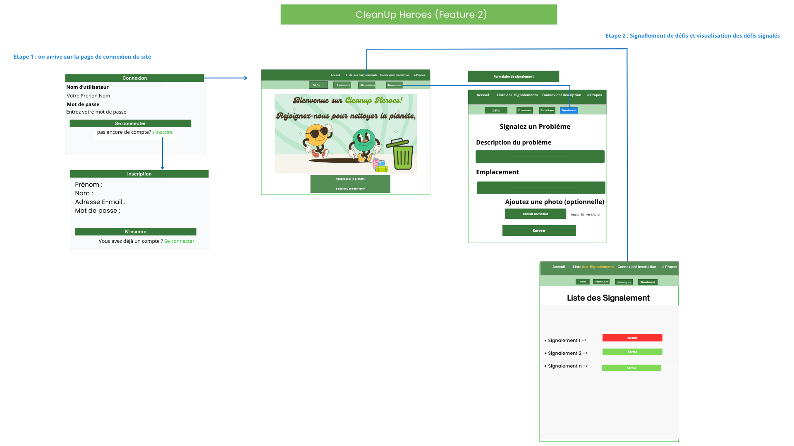

= Backend APP

== CleanUp Heroes
Adjedomole, Barry, Rahim

== Description de l'application
Ce site a pour ambition de sensibiliser les citoyens au tri sélectif et au respect de l’environnement tout en les encourageant à agir activement pour améliorer leur cadre de vie. Les utilisateurs peuvent participer à des **challenges environnementaux** qui leur permettent de gagner des points en réalisant des actions concrètes, telles que le tri des déchets ou la participation à des initiatives locales. Ces points accumulés pourront, à l’avenir, être échangés contre des récompenses concrètes, renforçant ainsi leur motivation à s’impliquer durablement.

En parallèle, le site offre une fonctionnalité clé : le **signalement de déchets abandonnés** dans les espaces publics. Ces signalements sont actuellement affichés sous forme de liste, mais une évolution future prévoit l’intégration d’une carte interactive. Chaque signalement sera représenté par un marqueur géolocalisé, offrant une vue claire des zones concernées. Une fois un déchet ramassé, son marqueur pourra être retiré de la carte pour refléter la propreté retrouvée de l’espace. Cette fonctionnalité vise à améliorer la coordination entre citoyens et services responsables, tout en fournissant un outil visuel pour mesurer les progrès réalisés.

Le site mettra également en avant des **classements mondiaux et locaux**, permettant aux utilisateurs de comparer leurs contributions avec celles des autres. Ces classements encourageront une saine compétition et renforceront le sentiment de communauté autour de la cause environnementale.

== Objectif de l'application
L’objectif global de ce projet est de promouvoir des comportements responsables, tels que le tri sélectif et la collecte des déchets, tout en récompensant l’engagement des utilisateurs. En combinant des éléments ludiques comme les challenges et les classements, des outils pratiques comme la carte interactive, et des perspectives d’avenir avec des récompenses concrètes, ce site ambitionne de devenir une plateforme incontournable pour tous ceux qui souhaitent agir pour l’environnement.

== Tableau comparatif des solutions existantes

[cols="1,2,2", options="header"]
|===
| **Solution**   | **Avantages** | **Limites**
| **Litterati**   | - Encourage un nettoyage collaboratif.+
- Implique activement les utilisateurs dans la géolocalisation des déchets. | - Dépend de l’implication des utilisateurs.+
- Difficulté à s’étendre dans les zones rurales.
| **Recyclebank** | - Récompenses attractives (réductions locales). +
- Incite au recyclage continu. | - Limité aux zones partenaires. +
- Offre de récompenses restreinte.
| **TrashOut**    | - Permet de signaler et cartographier les déchets. +
- Facilite une gestion collective. | - Dépend des signalements des utilisateurs (informations parfois inexactes). +
- Système décentralisé.
| **Tidy Towns**  | - Encourage la participation communautaire par des récompenses. +
- Focalisé sur l’embellissement des villes. | - Nécessite une bonne organisation d’événements. +
- Implique fortement les communautés locales.
| **EcoHero**     | - Dimension ludique avec des défis et récompenses. +
- Encourage des comportements durables. | - Manque d’adaptation aux spécificités locales. +
- Nécessite un engagement constant des utilisateurs.
|===

== Avantages supplémentaires de **CleanUp Heroes**

**CleanUp Heroes** apporte des innovations et fonctionnalités supplémentaires par rapport aux solutions existantes :

. **Fonctionnalités intégrées et complémentaires** :
   * **Signalements cartographiés** : Les utilisateurs peuvent signaler des déchets géolocalisés via une carte interactive, qui évolue en temps réel. Les signalements peuvent être retirés une fois les déchets ramassés.
   * **Classements dynamiques** : Un classement mondial et local permet de motiver les utilisateurs en favorisant une saine compétition.
   * **Récompenses concrètes** : Les utilisateurs peuvent gagner des avantages auprès de commerçants locaux en atteignant des objectifs spécifiques, renforçant leur motivation.

. **Impact visible et mesurable** :
   L'application propose une estimation chiffrée de l’impact positif des actions des utilisateurs (par exemple, quantité de déchets collectés, CO2 économisé), renforçant leur sentiment d'accomplissement et d’utilité.

. **Engagement communautaire renforcé** :
   En liant les défis individuels et communautaires, l'application crée une synergie entre citoyens, entreprises locales et collectivités, encourageant une participation active à grande échelle.

. **Conception ludique et motivante** :
   Grâce à l'intégration d'éléments ludiques comme les défis et les récompenses, CleanUp Heroes s’assure de maintenir un haut niveau d’engagement des utilisateurs.

== Architecture de l'application

== Features

=== Reporting

=== Challenges

== FEATURE 1

=== Participation à un défi
.**Objectif** :
Cette fonctionnalité permet à l’utilisateur de participer activement à un défi. Lors de la soumission, l'utilisateur peut :
* Renseigner la quantité réalisée pour le défi (par exemple, kilos de déchets triés).
* Indiquer la date de réalisation.
* Joindre une photo comme preuve de sa contribution.

.**But principal** :
Faciliter la collecte de données sur les actions réalisées par les utilisateurs tout en garantissant la vérifiabilité des participations. Cela permet de valoriser les efforts de chacun et de maintenir une transparence dans le processus.

=== Affichage des défis disponibles
.**Objectif** :
Cette fonctionnalité permet aux utilisateurs de visualiser tous les défis de tri et de réduction des déchets disponibles auxquels ils n'ont pas encore participé. Chaque défi est accompagné de détails importants tels que son nom, sa description, ses dates de validité, les actions attendues, et les points qu’il rapporte.

.**But principal** :
Encourager les utilisateurs à s’impliquer dans les initiatives écologiques proposées par la plateforme en leur fournissant une vue claire et détaillée des défis disponibles. La possibilité de participer en un clic renforce l'engagement.

=== Statistiques des défis
.**Objectif** :
Cette fonctionnalité offre à l'utilisateur un tableau de bord interactif permettant de suivre ses performances et ses progrès dans les défis. Elle inclut des statistiques telles que :
* Le nombre total de défis accomplis.
* La quantité totale réalisée dans les actions demandées.
* Le score total accumulé.
* La progression des défis en cours (en pourcentage).

.**But principal** :
Motiver les utilisateurs en leur offrant un retour visuel sur leurs réalisations et leur impact positif. Cela favorise également une compétition saine et un sentiment de satisfaction personnelle.

=== Diagramme de séquence

== Les défis
image::images/defi.png[defi, width=500, align=center]

== Statistiques
image::images/stat.png[statistiques, width=500, align=center]

== Feature 2

= Résumé du système de gestion des signalements

== Formulaire de signalement
* Objectif : Permet à un utilisateur de signaler un problème ou une situation nécessitant une intervention, avec des champs pour décrire le problème, le lieu, et joindre une photo.
* Fonctionnement : Après soumission, les données sont envoyées au backend via une requête API pour être enregistrées dans une base de données.
* Exemple d'interaction : L'utilisateur remplit le formulaire, soumet les données, et reçoit un message de confirmation.

== Liste des signalements
* Objectif : Afficher tous les signalements et permettre la gestion de leur statut (ouvert/fermé).
* Fonctionnement : Les signalements sont récupérés depuis le backend et peuvent être filtrés, triés et mis à jour par l'utilisateur.
* Exemple d'interaction : L'utilisateur change le statut d'un signalement de "ouvert" à "fermé", ce qui est mis à jour dans la base de données.

== Scénarios d'utilisation
* Utilisateur standard : Crée un signalement, consulte les signalements existants, et met à jour leur statut si autorisé.
* Administrateur : Gère tous les signalements, peut les fermer, réouvrir et attribuer des actions.
* Responsable du traitement des signalements : Peut uniquement consulter et marquer les signalements comme résolus.

Ce système permet une gestion facile des problèmes signalés, avec des fonctionnalités de création, consultation et mise à jour des signalements.
 
== Formulaire de signalement

== Liste des signalements

= Wireframe

==Acceui

image::images/1.png[wire1, width=500, align=center]

== Feature 1

== Feature 2

== à propos

